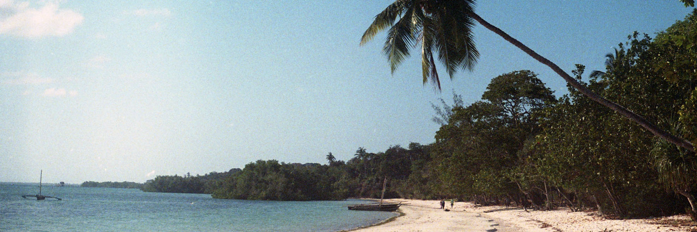

Pemba Island, Zanzibar, Tanzania :tanzania: - Shot with a Zenit-E & Helios 44-2 58mm on Kodak Ultramax 400 film.

## 👋 Hi there, I'm Raf
I'm a full stack engineer with 10+ years of professional experience, having worked for companies such as [Rockstar North](https://www.rockstarnorth.com/), [IBM](https://www.ibm.com/) and [SatoshiLabs](https://satoshilabs.com/) in the past. I'm a digital nomad and passionate photographer, always looking for the next adventure ✈️

At the moment, I'm:
- 🏗️ Building my own product (more details soon).
- 🎲 Working on my own game using [Godot](https://godotengine.org/).
- 💻 Using Windows 11 and Fedora 36 on an [Asus Zephyrus m16 2022](https://rog.asus.com/us/laptops/rog-zephyrus/rog-zephyrus-m16-2022-series/).
- 💿 Developing with [Visual Studio Code](https://code.visualstudio.com/) and [JetBrains Rider](https://www.jetbrains.com/rider/).
- 🤝 On [LinkedIn](https://www.linkedin.com/in/rafaelkeramidas/) for professional networking.
- 🕹️ Playing [Frostpunk](https://www.frostpunkgame.com/) and [Prison Architect](https://www.paradoxinteractive.com/games/prison-architect/).
- 📝 Sometimes writing on my [blog](https://ker.af/).
- 📸 Or sometimes publishing photos on my [photography website](https://raf.photography).

### Favourite tech
The tech I love to use and I am the most familiar with...

<table>
    <tr>
        <td align="center" width="96">
            
             
            .NET / C#
        </td>
        <td align="center" width="96">
            
             
            NodeJS
        </td>
        <td align="center" width="96">
            
             
            TypeScript
        </td>
        <td align="center" width="96">
            
             
            React
        </td>
        <td align="center" width="96">
            
             
            SolidJS
        </td>
        <td align="center" width="96">
            
             
            Electron
        </td>
        <td align="center" width="96">
            
             
            Tauri
        </td>
    </tr>
    <tr>
        <td align="center" width="96">
            
             
            PostgreSQL
        </td>
        <td align="center" width="96">
            
             
            Redis
        </td>
        <td align="center" width="96">
            
             
            Vite
        </td>
        <td align="center" width="96">
            
             
            Docker
        </td>
        <td align="center" width="96">
            
             
            Kubernetes
        </td>
        <td align="center" width="96">
            
             
            Terraform
        </td>
        <td align="center" width="96">
            
             
            AWS
        </td>
    </tr>
</table>
